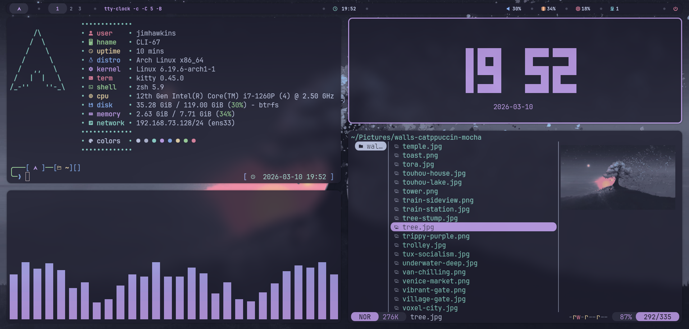
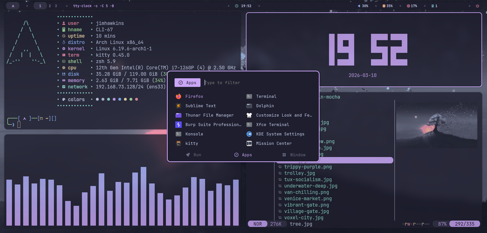
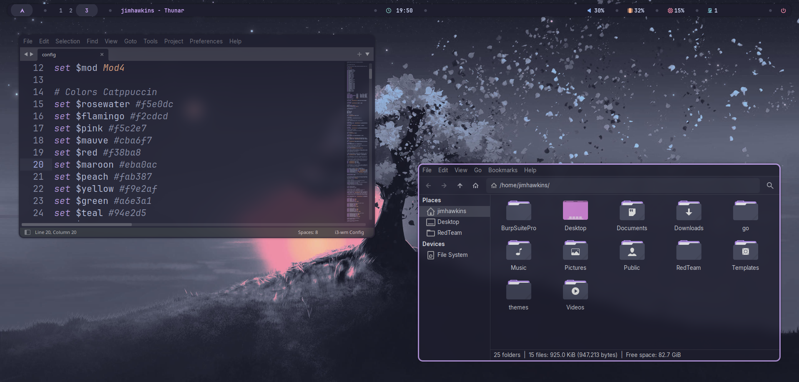

# 😺 Catppuccin Mocha Dotfiles

A minimal and aesthetic configuration for **Arch Linux**, featuring **i3wm** and themed with the **Catppuccin Mocha** palette. This setup focuses on a clean look and a productive workflow.

---

## 🖼️ Screenshots

  

  

  

---

## 🛠️ System Components

* **OS:** Arch Linux x86_64
* **Window Manager:** i3 with Smart Borders
* **Status Bar:** Polybar (Pill-style design)
* **Terminal:** Kitty (JetBrainsMono Nerd Font)
* **Compositor:** Picom (Rounded corners & Transparencies)
* **Launcher:** Rofi (Custom Mocha theme)
* **File Manager:** Yazi / Thunar
* **Lockscreen:** Betterlockscreen (Custom Mauve Ring)
* **System Monitor:** btop / Mission Center

---

## ⌨️ Quick Shortcuts

| Shortcut | Action |
| :--- | :--- |
| `Mod + Return` | Open Kitty Terminal |
| `Mod + d` | App Launcher (Rofi) |
| `Mod + p` | Toggle Picom (On/Off) |
| `Mod + x` | Lock Screen (Betterlockscreen) |
| `Mod + c` | Clipboard Manager (Greenclip) |
| `Mod + Shift + s` | Screenshot (Flameshot) |
| `Mod + Shift + e` | Powermenu (Logout/Reboot/Shutdown) |
| `Mod + Shift + q` | Kill Focused Window |

---

## 🎨 Colors & Style

The entire system follows the **Catppuccin Mocha** color scheme. You can find more details about the palette and the project on their official website:
👉 [https://catppuccin.com/](https://catppuccin.com/)

* **GTK Theme:** Catppuccin-Mocha-Mauve
* **Icons:** Tela-dracula-dark
* **Cursor:** Catppuccin-Mocha-Mauve

---

## 💡 Configuration Highlights

### Fonts
* **Interface:** Inter / Noto Sans
* **Terminal/UI Icons:** JetBrainsMono Nerd Font

---

## 📜 Credits

* **Polybar Inspiration:** [owl_dots by prolinux410](https://gitlab.com/prolinux410/owl_dots/-/tree/main/i3wm/i3_catppuccin)
* **Wallpaper:** [walls-catppuccin-mocha by orangci](https://github.com/orangci/walls-catppuccin-mocha)

---
